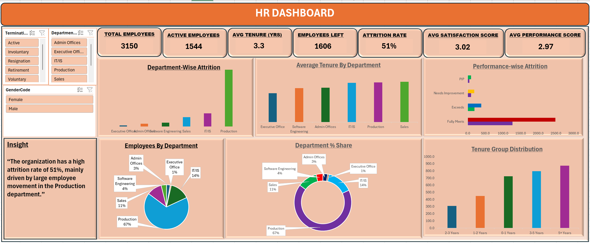

# HR-Attrition-Dashboard
Interactive Excel dashboard analyzing employee attrition, workforce distribution, performance, and tenure trends across departments.

## Project Type

Excel Dashboard | HR Analytics | Workforce Intelligence

## Project Overview

This project presents an interactive HR Analytics Dashboard built in Excel to analyze employee attrition, workforce distribution, tenure patterns, and performance trends across departments. The dashboard helps HR teams identify key attrition drivers and support workforce planning decisions.

## Dataset

The dataset contains employee records including department, gender, tenure, performance rating, employment status, and attrition information.

## Tools Used

* Microsoft Excel
* Pivot Tables
* Pivot Charts
* Slicers
* KPI Cards
* Data Visualization

## Key Performance Indicators (KPIs)

* Total Employees: 3,150
* Active Employees: 1,544
* Employees Left: 1,606
* Attrition Rate: 51%
* Average Tenure: 3.3 Years
* Average Satisfaction Score: 3.02
* Average Performance Score: 2.97

## Dashboard Features

* Department-wise attrition analysis
* Employee distribution by department
* Average tenure by department
* Performance-wise attrition tracking
* Workforce demographic filtering
* Interactive slicers for department, gender, and termination type

## Key Insights

* The organization has a high attrition rate of 51%.
* The Production department accounts for the largest share of employee attrition.
* Employees with lower performance ratings show higher turnover patterns.
* Workforce concentration is heavily skewed toward the Production department.
* Employee tenure trends indicate retention challenges within specific groups.

## Dashboard Preview

## Business Impact

This dashboard enables HR professionals to identify turnover trends, monitor workforce health, and develop targeted employee retention strategies through data-driven decision-making.

## Skills Demonstrated

* HR Analytics
* Excel Dashboarding
* KPI Reporting
* Data Visualization
* Workforce Analytics
* Attrition Analysis
* Employee Performance Analysis
* Business Intelligence
* Pivot Table Analysis

## Conclusion

This project demonstrates the ability to transform HR data into actionable insights using Excel, helping organizations understand workforce dynamics and improve employee retention initiatives.
